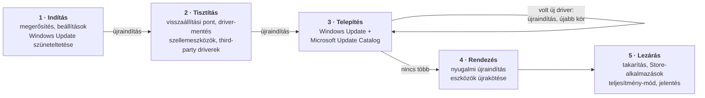

<div align="center">

# 🧙‍♂️ DriverVarázsló

### Egy kattintás. Nulláról, gyári driverekkel felszerelt gép. Felügyelet nélkül.

**Windows-driverkezelő és szervizeszköz számítógép-szervizeknek.**<br/>
Letörli a hibás driverkészletet, a gépet a Windows Update-ről és a Microsoft Update Catalogból újradriverezi,<br/>
ellenőrzi, hogy minden eszköz tényleg átvette a drivert — és a végén pontos jelentést ad arról, amit tett.

<br/>

[](https://github.com/egonixaimgod/DriverVarazslo/releases)
[](#-rendszerkövetelmények)
[](#-fejlesztés)
[](https://github.com/egonixaimgod/DriverVarazslo/commits/main)

<br/>

[**📥 Letöltés**](https://github.com/egonixaimgod/DriverVarazslo/raw/main/dist/DriverVarazslo.exe) &nbsp;·&nbsp;
[Funkciók](#-funkciók) &nbsp;·&nbsp;
[Az 1 kattintásos fix](#-az-1-kattintásos-fix) &nbsp;·&nbsp;
[Így talál drivert](#-így-talál-drivert) &nbsp;·&nbsp;
[Követelmények](#-rendszerkövetelmények) &nbsp;·&nbsp;
[Fejlesztés](#-fejlesztés)

</div>

---

## 💡 Miért született?

Egy szervizbe érkező gép driverkészlete jellemzően **hibás, hiányos vagy egy másik gépről ottmaradt**. A kézi rendbetétel — eszközönként megkeresni, letölteni, feltelepíteni, ellenőrizni — gépenként órákat visz el, és az eredmény a technikus türelmén múlik.

A DriverVarázsló ezt a munkát egyetlen, felügyelet nélkül futó folyamattá teszi:

> **Megnyomod az 1 kattintásos fixet, elmész egy kávéra, és egy hibátlanul feldriverezett géphez térsz vissza — egy összefoglalóval arról, mi települt, mi maradt és miért.**

Laptopon, asztali gépen, gyári és összerakott gépen egyaránt: a program nem gépmodellekre van hangolva, hanem a hardver saját azonosítóiból dolgozik.

---

## ✨ Kiemelt tulajdonságok

<table>
<tr>
<td width="33%" valign="top">

### 🚀 Felügyelet nélkül
Kattintás után a program magától végigviszi a törlést, a telepítési köröket és az újraindításokat. Ütemezett feladattal folytatja a munkát minden rendszerindítás után — akkumulátorról is.

</td>
<td width="33%" valign="top">

### 🎯 Két forrás, egy döntés
A **Windows Update Agent** és a **Microsoft Update Catalog** együtt dolgozik. A program a gép saját hardverazonosítóira keres, és a legfrissebb, *ehhez a géphez való* gyári kiadást választja.

</td>
<td width="33%" valign="top">

### ✅ Bizonyíték, nem feltételezés
Sikernek csak az számít, amit a rendszer visszaigazol: az eszköz tényleg átvette a drivert, a beállítás tényleg érvénybe lépett. A visszatérési kód önmagában soha nem verdikt.

</td>
</tr>
<tr>
<td width="33%" valign="top">

### 🔒 Védőhálók
Rendszerindítási útvonal védelme, tároló- és firmware-tiltás, nyomtató- és Wi-Fi-védelem, visszaállítási pont és teljes driver-mentés a törlés előtt.

</td>
<td width="33%" valign="top">

### 💻 GUI és teljes értékű CLI
Modern grafikus felület, és egy vele egyenértékű parancssoros mód a gyenge vagy régi gépekre — **ugyanazzal a logikával**, nem lebutított változatként.

</td>
<td width="33%" valign="top">

### 📜 Mindent naplóz
Minden parancs, döntés és kattintás bekerül a diagnosztikai naplóba, így egy terepen lefutott javítás utólag is pontosan visszakövethető.

</td>
</tr>
</table>

---

## 🧭 Funkciók

| Modul | Mire való |
|---|---|
| 🚀 **1 kattintásos driver fix** | A teljes újradriverezés felügyelet nélkül, újraindításokon át — [részletek lent](#-az-1-kattintásos-fix) |
| 🖥️ **Driver keresés és telepítés** | Kézi szken: minden eszközre megmutatja, van-e újabb gyári driver, és kijelölés után feltelepíti |
| 💿 **Driverek kezelése** | A telepített third-party driverek listája használat szerint, a gép alkatrész-térképével, törléssel és karbantartó eszközökkel |
| 💾 **Mentés és visszaállítás** | Driverek mentése, visszaállítása élő vagy **nem induló** Windowsba, WIM/ESD-kinyerés, rendszerindítás-javítás |
| 🪟 **Operációs rendszer** | Windows Update driverkezelése, Windows & Office licencállapot és aktiválás, BitLocker, hálózat-blokkoló |
| 🎨 **Kijelző és színkezelés** | HDR, automatikus színkezelés (ACM), ICC-profilok SDR/HDR módra, gamma, panel-adatok, gyári visszaállítás |
| 🧹 **Rendszer karbantartás** | Ideiglenes fájlok, gyorsítótárak és komponenstár takarítása — előre megmutatott méretekkel |
| 🔥 **Stresszteszt és szervizprogramok** | FurMark, Prime95, Linpack, HWiNFO egy gombbal, automatizált indítással és ablak-elrendezéssel |
| 🏆 **Benchmark** | Automatikus Cinebench R20 + FurMark mérés, összehasonlítható eredményekkel és felhős ranglistával |
| 📊 **Rendszer riport** | Egyoldalas, nyomtatható hardverriport S.M.A.R.T.-adatokkal |

<details>
<summary><b>🖥️ Driver keresés és telepítés — részletek</b></summary>
<br/>

- **Minden jelen lévő eszközre keres.** Kizárva csak az marad, ami nem hardver (kötetek, hangvégpontok, nyomtatósorok), illetve a tároló- és firmware-eszközök.
- **Áttekinthető eredmény:** *Teendő / Hibás / Nem telepíthető / Naprakész* fülek, a hibakódos eszközök mellett érthető teendővel.
- **Telepített verzió mindenhol látszik** — a felajánlott driver dátuma és verziója a jelenlegi mellett.
- **Gyors mód:** a katalógus-keresés kikapcsolható, ha csak egy gyors Windows Update-átfutás kell.
- **Hibakódos eszközök gyorsjavítása** (engedélyezés, újraindítás) közvetlenül a listából.
- **Store-alkalmazások:** a driverek által kért vezérlőpultokat (pl. NVIDIA Vezérlőpult) is felismeri és telepíti.
- Az **elrejtett** Windows Update-drivereket megmutatja, de szándékosan nem telepíti — azt valaki tudatosan tiltotta le.

</details>

<details>
<summary><b>💿 Driverek kezelése — részletek</b></summary>
<br/>

- **Használat szerinti besorolás, bizonyítékkal:** *Használatban / Készenlétben / Nem használt*. A program négynél több független jelből dönt — jelen lévő eszköz, futó kernel-szolgáltatás, bejegyzett nyomtató, szűrő-regisztráció —, így a vírusirtók és távelérés-programok eszköz nélküli driverei sem tűnnek „feleslegesnek”.
- **A gép felépítése:** interaktív ábra (laptop vagy asztali gép) arról, melyik driver melyik alkatrészé — videokártya, alaplapi hang, hálózat, chipset, külső eszközök. A döntés a Windows eszközfájából és a PCI-topológiából jön, nem a driver neve alapján.
- **Nyomtató-szűrő:** a nyomtató-drivereket az INF tartalmából ismeri fel — akkor is, ha a nyomtató épp nincs a géphez csatlakoztatva.
- **Elavult duplikátumok** takarítása a DriverStore-ból (a legfrissebb kiadás marad, a használatban lévő soha nem törlődik).
- **Szellemeszközök** eltávolítása és **eszközök újrakötése**, hogy a Windows a gyári drivert válassza.
- **Minden driver törölhető** — offline módban is. Ha egy rossz driver miatt nem indul a gép, egy másik Windowsból indítva pont azt a csomagot lehet eltávolítani.

</details>

<details>
<summary><b>💾 Mentés, visszaállítás és offline javítás — részletek</b></summary>
<br/>

- Teljes driver-mentés és visszaállítás, régi mentésekből is.
- **Offline mód:** a program egy másik Windowsból vagy WinPE-ből indítva a sérült telepítés driverein dolgozik (`dism /Image`).
- Driverek kinyerése **WIM/ESD** telepítőképekből.
- Rendszerindítás (BCD) automatikus javítása offline visszaállítás után.
- Visszaállítási pont létrehozása egy kattintással.

</details>

<details>
<summary><b>🪟 Operációs rendszer — részletek</b></summary>
<br/>

- **Windows Update:** automatikus driverfrissítés tiltása és visszaállítása, szüneteltetés, gyorsítótár-törlés — visszaolvasott eredménnyel.
- **Windows & Office aktiválás:** licencállapot közvetlenül WMI-ből, a **BIOS-ba égetett gyári kulcs** kiolvasása és használata, KMS-aktiválás a szerviz saját kiszolgálójával. A végeredményt a program a rendszertől kérdezi vissza.
- **BitLocker:** a rendszermeghajtó állapota és a titkosítás kikapcsolása.
- **Hálózat-blokkoló szkript** letöltése tűzfal-alapú internettiltáshoz.

</details>

<details>
<summary><b>🎨 Kijelző és színkezelés — részletek</b></summary>
<br/>

- HDR és automatikus színkezelés (ACM) kapcsolása kijelzőnként, a Windows DisplayConfig API-ján át.
- ICC-profilok hozzárendelése **külön SDR és HDR módra**, és annak megjelenítése, melyik profil fut ténylegesen.
- A panel adatai az EDID-ből: csúcsfényerő, fekete szint, színtér (a gyártó által közölt értékek).
- A videokártya gamma-görbéjének kiolvasása és ábrázolása — ez az egyetlen közvetlen bizonyíték arra, hogy valami módosítja-e a képet.
- Profilkönyvtár, árva hozzárendelések javítása, tartós zárak, és **teljes gyári visszaállítás** előnézettel.

</details>

<details>
<summary><b>🔥 Stresszteszt, szervizprogramok és benchmark — részletek</b></summary>
<br/>

- **Stresszteszt egy gombbal:** FurMark, Prime95, Linpack Xtreme és HWiNFO64 indul, a program automatikusan megválaszolja az indítóablakokat, majd négy negyedre rendezi az ablakokat. A képernyő-elalvás a teszt idejére kikapcsol, utána visszaáll.
- **Szervizprogramok külön is:** HD Sentinel, CPU-Z, GPU-Z, ZenTimings, NVIDIA Profile Inspector — hordozhatóan vagy telepítve.
- **Benchmark:** Cinebench R20 többmagos teszt és FurMark mérés rögzített beállításokkal; a FurMark háromszor fut, a legjobb számít, a kép pontosan 1024×768-ban renderelődik minden gépen — így az eredmények valóban összehasonlíthatók.
- **Felhős ranglista** gépnév szerinti bejegyzésekkel.

> A harmadik féltől származó programok külön csomagban, első használatkor töltődnek le, és a saját licencük vonatkozik rájuk.

</details>

<details>
<summary><b>📊 Riport, nyomtatás és karbantartás — részletek</b></summary>
<br/>

- **Rendszer riport:** CPU, RAM (a gyártót a modul cikkszámából is felismeri), videokártya valódi VRAM-mérettel, alaplap, háttértárak S.M.A.R.T.-adatokkal. Mindig egy oldalra fér, és egy kattintással a szerviz nyomtatójára küldhető.
- **Bolti tábla:** két gép A5-ös árlapja a szerviz saját Word-sablonjából, előre kitöltött mezőkkel.
- **Rendszer karbantartás:** ideiglenes fájlok, Windows Update- és kézbesítés-optimalizálási gyorsítótár, hibajelentések, böngésző-gyorsítótárak (csak a gyorsítótár — süti, jelszó, előzmény nem), Lomtár, komponenstár. Kategóriánkénti méret előre, a felszabadult hely utólag mérve.

</details>

---

## 🚀 Az 1 kattintásos fix

A fix **nem menti el és nem teszi vissza** a gép régi drivereit: azok jellemzően épp a hiba okai. Helyette mindent letöröl, amit a technikus nem jelölt megtartandónak, és a gépet **nulláról** driverezi újra, megbízható forrásokból.



**A megerősítő ablakban a technikus dönt**, és ezek a döntések minden újraindításon át érvényben maradnak:

| Beállítás | Hatása |
|---|---|
| **Törlési előnézet** | Minden törlendő csomag látszik, azzal együtt, *mire való* és *használja-e most a gép* — csomagonként kivehető |
| **Nyomtató-driverek megtartása** | A gép nyomtatói a szerviz után is működnek, akkor is, ha épp nincsenek csatlakoztatva |
| **Wi-Fi mód** | Kábel nélküli gépen a hálózat végig megmarad: a Wi-Fi driver nem törlődik, a mentett hálózatok (titkosítva) visszaállnak, a gép automatikusan visszacsatlakozik |
| **Wi-Fi driver újraépítése** | A Wi-Fi adapter beállításai tiszta lapról épülnek fel, a mentett hálózat automatikus visszaállításával |
| **Teljes / gyors keresés** | A Microsoft Update Catalog bevonása vagy kihagyása |
| **Windows Update szüneteltetése** | A frissen felrakott, összehangolt driverkészletet a Windows ne írja felül napokkal később |

**A lezáró lépések:** a régi, kiváltott driverek eltávolítása a DriverStore-ból · a driverekhez tartozó Store-alkalmazások telepítése · teljesítmény-centrikus energiaséma · zárójelentés arról, mi települt, mi maradt Windows-alapdriveren és miért, valamint mely korábbi csomagok nem kerültek vissza.

> [!NOTE]
> A lánc akkor ér véget, amikor egy telepítési kör **már nem talál új drivert** — nem egy előre rögzített lépésszámnál. Egy biztonsági felső korlát ettől függetlenül megakadályozza, hogy egy rendellenes gép végtelen körbe kerüljön.

---

## 🔎 Így talál drivert

Minden eszközön ugyanaz a döntési lánc fut le — a kézi szkenben és az 1 kattintásos fixben egyaránt, **ugyanazzal a kóddal**.

| # | Lépés | Mit biztosít |
|:-:|---|---|
| 1 | **Eszközfelmérés** | Minden jelen lévő eszköz, az összes hardverazonosítójával. Kizárás csak a nem-hardver objektumokra és a tároló/firmware eszközökre. |
| 2 | **Windows Update Agent** | A Microsoft szerveroldali, erre a gépre célzott ajánlata. |
| 3 | **Microsoft Update Catalog** | Keresés a gép *specifikus* azonosítóira, dátum szerint rendezett lapozással, operációs rendszer és architektúra szerinti pontozással. Típuskódra (ami bármely gyártó csomagját behozná) nem keres. |
| 4 | **Kiadás-kapu** | Csak újabb kiadás mehet fel; gyári driveren futó eszközt soha nem léptet vissza. Windows-alapdriveren álló eszköznél a régebbi gyári driver is jobb a semminél. |
| 5 | **Letöltés előtti ellenőrzés** | A katalógus saját adatlapja szerint támogatja-e a csomag *ezt* az eszközt — egy másik gépgyártó változata így letöltés nélkül kiesik. |
| 6 | **INF-vizsgálat** | A kicsomagolt driver valóban illik-e az eszközre és a telepített Windows-verzióra; csak az illeszkedő INF-ek kerülnek fel. |
| 7 | **Kötés-ellenőrzés** | Az eszköz tényleg átvette-e a drivert. Ha nem, a program a következő jelöltet próbálja, és megjegyzi a kudarcot. |
| 8 | **Őszinte zárás** | Ha egy eszközhöz tényleg nincs csomag, azt a program **néven nevezi**, a teendővel együtt — nem hallgatja el. |

---

## 🔒 Biztonság és védőhálók

| Védelem | Mit jelent a gyakorlatban |
|---|---|
| **Rendszerindítási útvonal** | A rendszerlemez eszközláncán lévő drivert a fix nem törli — egy hibás tárolóvezérlő-csere a gépet indíthatatlanná tenné. |
| **Tároló és firmware** | Tárolóvezérlő-drivert és firmware-t a program automatikusan **soha** nem telepít: ezek hibája helyreállítóhordozót vagy hardvercserét igényelhet. |
| **Visszaállítási pont + driver-mentés** | A törlés előtt mindkettő elkészül, kézi mentsvárként. |
| **Visszaléptetés-védelem** | Működő gyári driver helyére régebbi kiadás nem kerül. |
| **Visszaolvasott verdikt** | Törlés, telepítés, aktiválás, energiaséma, Windows Update-beállítás: az eredményt mindig a rendszer tényleges állapotából olvassa vissza. |
| **Megszakíthatóság** | A megszakítás az újraindítás előtti türelmi időben is érvényes, és a folytatásra ütemezett feladat is törlődik. |
| **Hálózat-tudatosság** | A folytatás megvárja a hálózatot (névfeloldással együtt), és kapcsolat nélkül semmit nem töröl. |

> [!IMPORTANT]
> A DriverVarázsló rendszerszintű változtatásokat végez (driverek törlése és telepítése, rendszerbeállítások módosítása). Szerviz- és rendszergazdai használatra készült; fontos adatokat tartalmazó gépen a futtatás előtt készíts biztonsági mentést.

---

## 💻 Kétféle felület

| | Grafikus felület | Parancssoros mód (CLI) |
|---|---|---|
| **Technológia** | pywebview + Microsoft WebView2, sötét „glassmorphism” téma | natív Windows-konzol, színes és keretes megjelenítés, ASCII-tartalékkal |
| **Mikor** | alapértelmezés minden modern gépen | régi vagy gyenge gépen, illetve ha a WebView2/.NET nem érhető el |
| **Funkciók** | a teljes eszközkészlet | ugyanaz a logika — ugyanazokat a modulokat hívja |
| **Váltás** | a felső sáv **CLI mód** gombja | `DriverVarazslo.exe --cli` |

Ha a grafikus felület egy gépen nem tud elindulni, a program ezt a következő indításkor felismeri, és magától a parancssoros módot hozza fel.

---

## 📋 Rendszerkövetelmények

| | Követelmény |
|---|---|
| **Operációs rendszer** | Windows 10 (1607 vagy újabb) / Windows 11, 64 bites |
| **Jogosultság** | Rendszergazda — a program UAC-kéréssel magától emeli a jogosultságát |
| **Grafikus felülethez** | Microsoft Edge WebView2 Runtime (109+) és .NET Framework 4.7.2+ — hiányuk esetén a program felajánlja a telepítésüket, addig a parancssoros mód működik |
| **Driverkereséshez** | Internetkapcsolat (Windows Update, Microsoft Update Catalog) |
| **Telepítés** | Nincs — egyetlen hordozható `.exe` |

---

## 📥 Letöltés és indítás

1. Töltsd le a legfrissebb **[DriverVarazslo.exe](https://github.com/egonixaimgod/DriverVarazslo/raw/main/dist/DriverVarazslo.exe)**-t (vagy válassz a [kiadások](https://github.com/egonixaimgod/DriverVarazslo/releases) közül).
2. Indítsd el, és fogadd el a rendszergazdai jogosultság kérését.
3. A kezdőlapon az **1 kattintásos fix** vár; a többi modul a bal oldali menüből érhető el.

> [!TIP]
> A program digitális aláírás nélküli, ezért első indításkor a Windows SmartScreen figyelmeztethet. Ilyenkor: **További információ → Futtatás mindenképp**.

**Indítási kapcsolók**

| Kapcsoló | Hatása |
|---|---|
| `--cli` | A parancssoros felülettel indul |
| `--force-gui` | A grafikus felületet akkor is megpróbálja, ha egy előfeltétel hiányzik |

**Automatikus frissítés:** induláskor a program ellenőrzi a GitHub-kiadásokat, és újabb build esetén felajánlja a frissítést. A letöltött fájl ellenőrzés után cserélődik; hibás letöltés soha nem írja felül a működő verziót.

---

## 📜 Naplózás és diagnosztika

A DriverVarázsló hibajelentése maga a napló. Egy szervizben lefutott javítás után a gép már az ügyfélnél van — amit a napló nem rögzített, az utólag nem deríthető ki.

- **Hely:** `C:\DriverVarazslo\DriverVarázsló_debug.log` (rotálva, 5 MB × 3)
- **Tartalom:** minden külső parancs a kimenetével és visszatérési kódjával, minden döntés *a bemenetével együtt* (melyik csomag, melyik eszköz, melyik telepített verzió ellen), minden szűrő azzal, amit kiszűrt, és minden felhasználói kattintás.
- **Szálbiztos:** a párhuzamos munkaszálak sorai a szál nevével azonosíthatók.
- A lánc végén a napló a szerviz felhőtárhelyére is felkerülhet, gépenként és futásonként rendezve.

---

## 🌐 Hálózati kapcsolatok

Átláthatóság kedvéért: a program kizárólag az alábbi szolgáltatásokkal kommunikál.

| Cél | Mire |
|---|---|
| Windows Update / Microsoft Update | driverkeresés és -telepítés |
| `catalog.update.microsoft.com` | driverkeresés a Microsoft Update Catalogban |
| Microsoft Store | a driverekhez tartozó alkalmazások |
| `github.com` | programfrissítés és a szervizprogram-csomag letöltése |
| A szerviz saját felhővégpontja | diagnosztikai napló és benchmark-ranglista |

Minden letöltés tanúsítvány-ellenőrzéssel történik; ez semmilyen tartalék útvonalon sincs kikapcsolva.

---

## 🏗️ Felépítés

```text
DriverVarazslo/
├── driver_tool.py           # belépési pont: jogosultság, előfeltételek, GUI/CLI indítása
├── ui.html                  # a teljes grafikus felület (HTML/CSS/JS, keretrendszer nélkül)
├── app/
│   ├── *_core.py            # a funkciók logikája — közös a GUI és a CLI számára
│   ├── win32.py             # Win32/ctypes: eszközfa (cfgmgr32), DisplayConfig, rendszerhívások
│   ├── common.py            # közös infrastruktúra: parancsfuttatás, letöltés, naplózás
│   ├── gui/                 # a grafikus felület API-ja, funkciónként egy modul
│   └── cli/                 # parancssoros felület: menü, konzol-megjelenítés, esemény-híd
├── tests/                   # offline regressziós tesztkészlet
├── DriverVarazslo.spec      # PyInstaller build-leírás
└── dist/DriverVarazslo.exe  # a kiadott program
```

**Tervezési elvek**

- **Egy logika, két felület.** Minden funkció magja egy `app/<funkció>_core.py` modulban él; a grafikus és a parancssoros felület csak megjeleníti az eredményt.
- **Tesztelhető mag.** A core modulok nem indítanak közvetlenül külső folyamatot — a parancsfuttatót paraméterként kapják, így a döntési logika valós terepi adatokon, hálózat és rendszerváltoztatás nélkül tesztelhető.
- **A verdikt a visszaolvasás.** Egy művelet csak akkor sikeres, ha a rendszer állapota ezt visszaigazolja.
- **Nincs néma hiba.** Elnyelt kivétel, jelzés nélküli szűrő vagy megmagyarázatlan kihagyás nincs a kódban.
- **Óraugrás-biztos időmérés.** Időtúllépések és mérések monoton órával — egy rendszeróra-szinkronizálás futás közben sem téveszti meg a programot.

---

## 🔧 Fejlesztés

**Előfeltételek:** Windows 10/11, Python 3.12, rendszergazdai jogosultság.

```bash
pip install pywebview pyinstaller pyflakes

python driver_tool.py          # indítás forrásból (grafikus felület)
python driver_tool.py --cli    # indítás forrásból (parancssoros mód)
```

**Ellenőrzés**

```bash
python -m unittest discover -s tests -v      # offline regressziós tesztek
python -m pyflakes app/ driver_tool.py       # statikus névellenőrzés
python -c "import app.gui.api, app.cli.api"  # a két API-osztály összeáll-e
```

**Build**

```bash
python -m PyInstaller --clean --noconfirm DriverVarazslo.spec   # -> dist/DriverVarazslo.exe
```

| Szkript | Mit csinál |
|---|---|
| `build.bat` | build-szám emelése + exe fordítása |
| `rebuild_verzioszam_novelessel_es_github_pushal.bat` | teljes kiadás: build-szám emelése, fordítás, commit, push és `build-N` GitHub-kiadás |

> [!CAUTION]
> A `main` ágra küldött exe a terepen futó példányok automatikus frissítésének forrása — egy push éles kiadásnak számít. A build-szám soha nem csökkenhet.

---

## ⚖️ Jogi tudnivalók

**Felelősség:** a programot a szerző a legjobb tudása szerint készítette, de a használata saját felelősségre történik. Driverek és rendszerbeállítások módosítása minden esetben kockázattal jár.

**Harmadik fél programjai:** a stressztesztelő, benchmark- és diagnosztikai programok (FurMark, Prime95, Linpack Xtreme, HWiNFO, HD Sentinel, CPU-Z, GPU-Z, ZenTimings, NVIDIA Profile Inspector, Cinebench, smartctl, SumatraPDF) nem részei ennek a repónak; a saját licencük vonatkozik rájuk. A Windows, a Windows Update és a Microsoft Update Catalog a Microsoft Corporation védjegyei és szolgáltatásai.

**Licenc:** a projekthez jelenleg nem tartozik nyílt forráskódú licenc — minden jog fenntartva.

<br/>

<div align="center">

Készült számítógép-szervizek mindennapi munkájához · 🇭🇺

</div>
